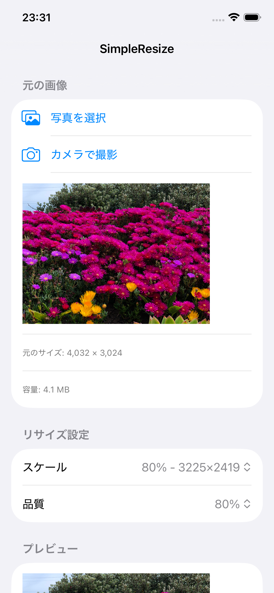

# SimpleResize

iOS向けのシンプルな画像リサイズアプリです。

## 機能

- **画像の取り込み** - 写真ライブラリから選択、またはカメラで撮影
- **スケール選択** - 20% / 40% / 60% / 80% / 100% から選択（リサイズ後のサイズも表示）
- **品質設定** - JPEG品質を 20% / 40% / 60% / 80% / 100% から選択
- **リアルタイムプレビュー** - スケールや品質を変更すると自動でプレビューと容量を表示
- **保存** - 写真ライブラリへの保存
- **共有** - メール、メッセージ、AirDrop、メモなどシステム共有シートから共有

## 使い方

1. 「写真を選択」または「カメラで撮影」で画像を取り込む
2. スケールと品質を選択する
3. プレビューで仕上がりと容量を確認する
4. 「写真ライブラリに保存」または「共有」で出力する

## 動作環境

- iOS 17.0+
- iPhone / iPad

## ビルド

Xcode で `SimpleResize.xcodeproj` を開いてビルドしてください。
